### 下载、安装、注册软件
#### 1 [点击下载软件包](./file/Proxifier-4.07.zip)

#### 2 解压安装包
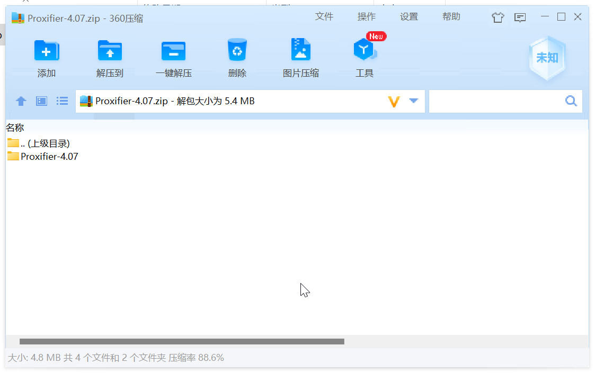

#### 3 双击 `Setup.exe` 安装软件
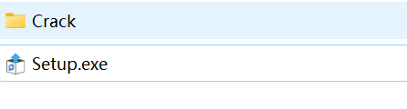

#### 4 打开`Crack`目录下的`keygen.exe`
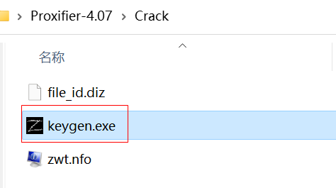

#### 5 复制key
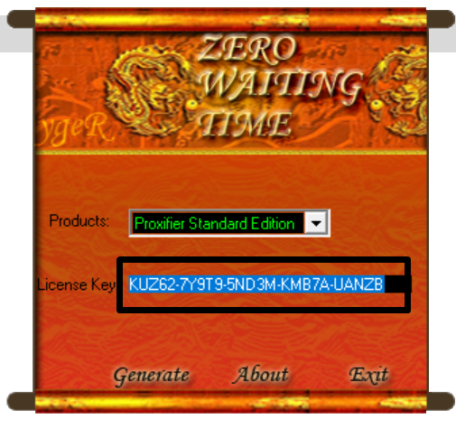

#### 6 打开软件,点击 `Enter Registration Key...`
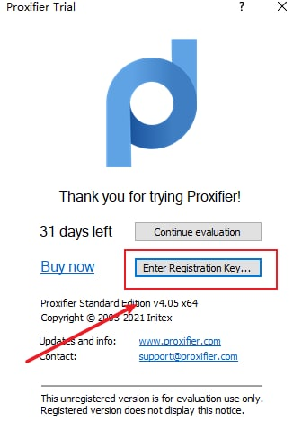

#### 7 ① 任意输入 ② 输入刚才复制的key
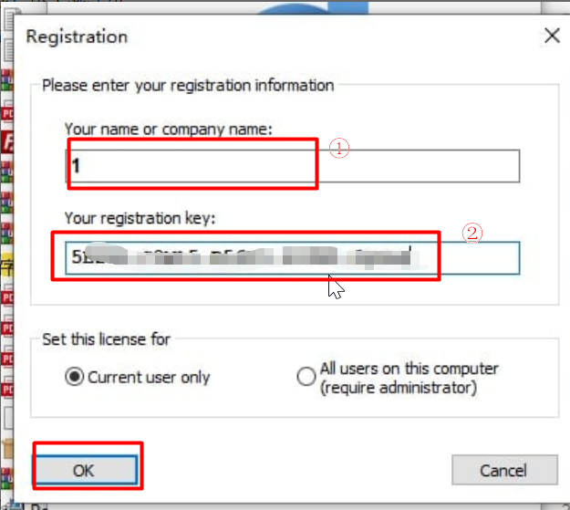

### 配置代理服务
#### 1 打开软件

#### 2 设置代理服务 `Profile` → `Proxy Servers`
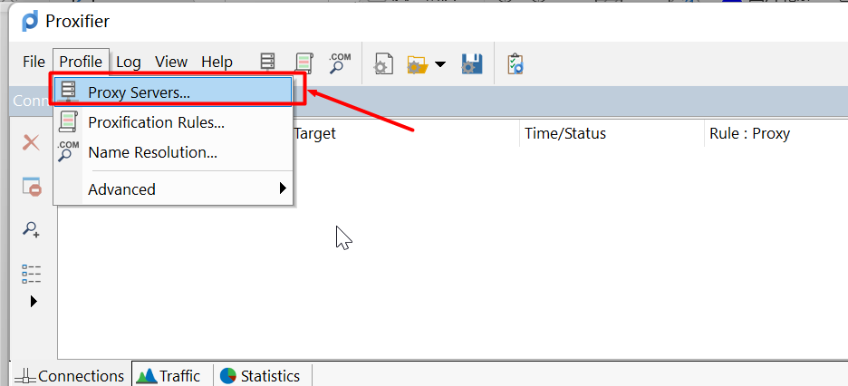

#### 3 ① `Socks IP` ② `Socks 端口` ③ `Socks 5协议`
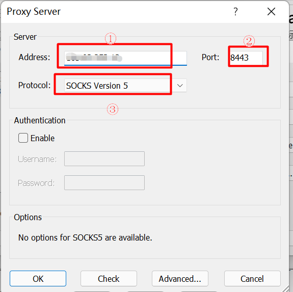

#### 4 设置代理规则 `Profile` → `Proxification Rules`
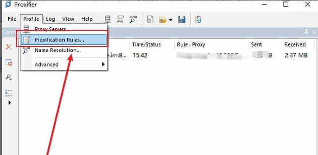

#### 5 `Add` 添加规则
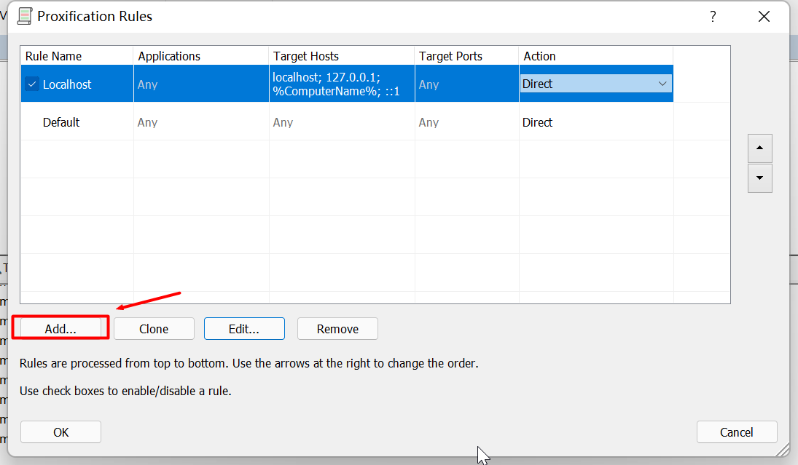

#### 6 ① `规则名称（任意）` ② `浏览本地文件，找到要使用代理的软件` ③ `选择刚才添加的代理服务` ④ `保存配置`
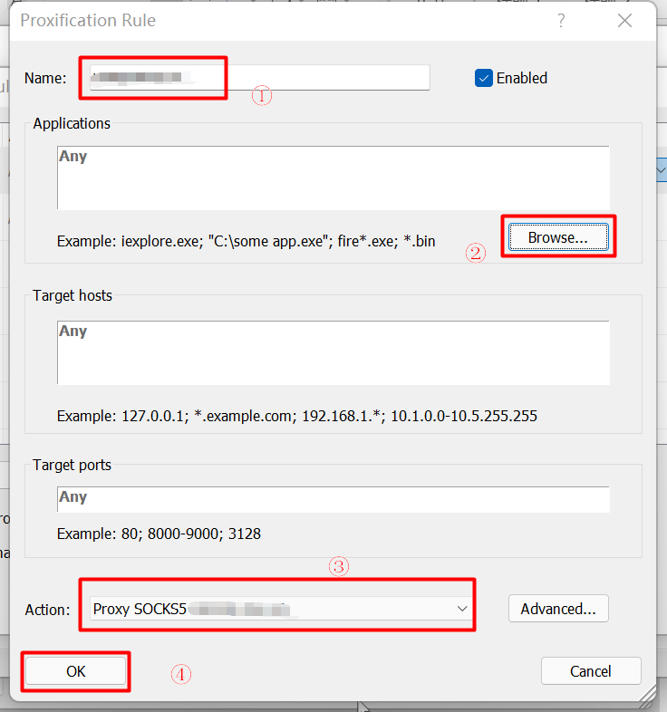
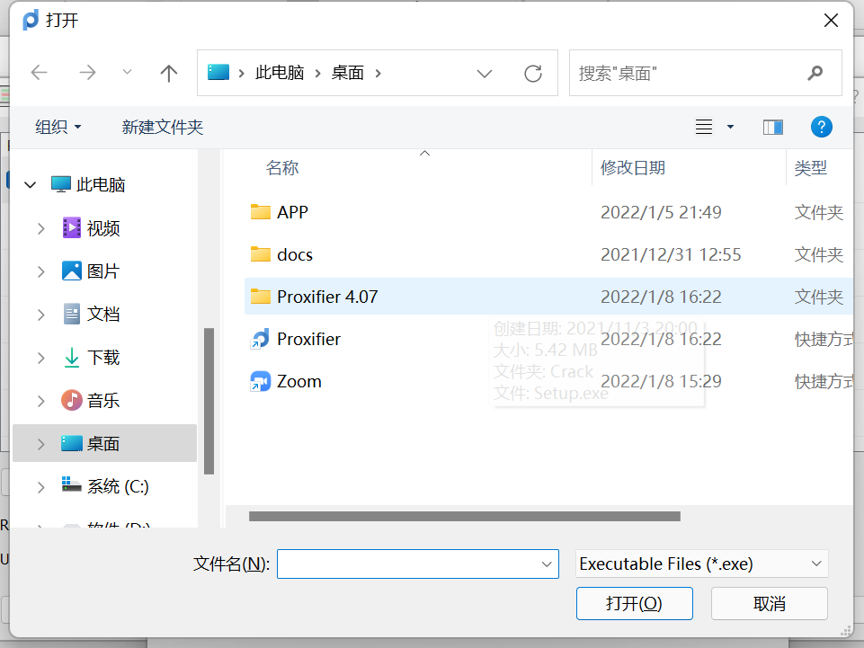

#### 7 打开添加好规则的软件，可以看到已经经过代理了。
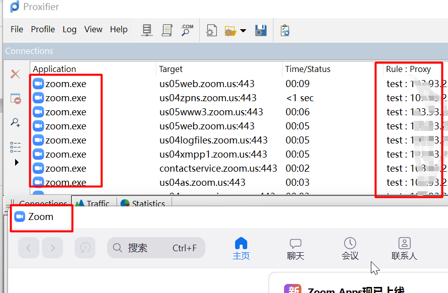
